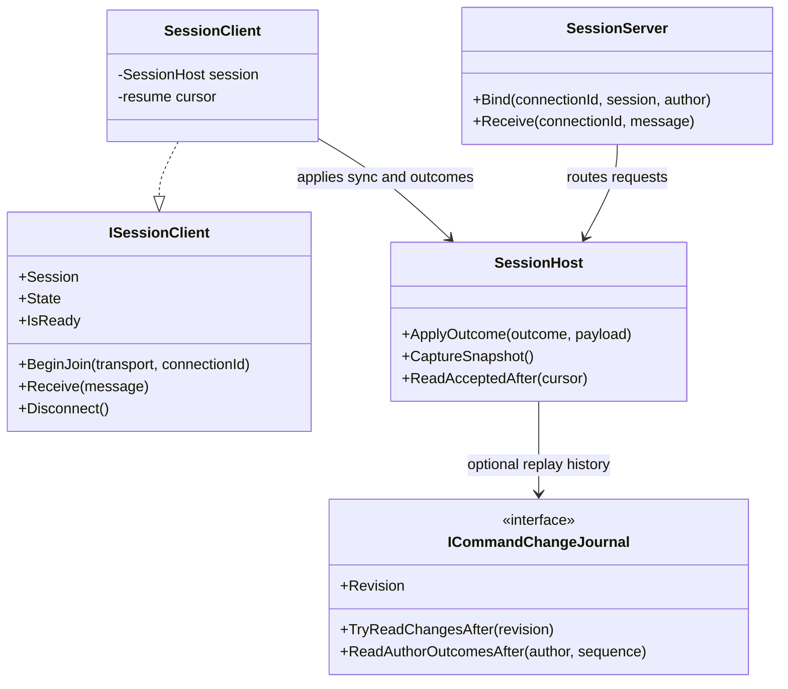

# DeltaNetcode API guide

DeltaNetcode owns command identity, validation, authoritative mutation, the
session journal and fixed-step rollback orchestration. The application owns
payload encoding, simulation state, authentication, transport and game logic.

## One session owner

`SessionHost` is the concrete session object and implements `ISession`. It owns
the command registry, journal, model, transport routes and command preparation
state. Consumers that need only session operations can keep an `ISession`
reference; they do not need separate references to the host's registry, journal
or model.

`CurrentStep` is the last step applied by `Tick` or restored from a snapshot.
At construction it is `SessionStart.Step - 1`. `Tick(step)` advances the model
and updates the session's current step. A session cannot tick backward.

Validators receive a `CommandValidationContext` when they run. Its
`CurrentStep` is the last step applied by the authoritative session, so time
checks use the same clock as scheduling.

`ISession` exposes command registration, send/cancel, transport connection
attachment, authoritative outcome application, ticking, snapshots, typed
command dispatch and replay reads. `VisitCommandType<TVisitor>` dispatches a
registered type ID through `ICommandVisitor`; the visitor may be a class or a
struct. The session keeps its registry private.

## Commands

Command payloads can be value or reference types registered by a stable
non-zero `ulong` ID. The application codec defines their byte encoding and
null handling. Applications can register types manually or use `[NetCommand]` and
the generated `GeneratedCommands` catalog. The generated catalog supplies
registrations; the application chooses which registrations to add to its
`CommandRegistry`.

Prediction can be enabled with `[NetCommand(Predicted = true)]` or with the
`isPredicted` argument when registering directly in `CommandRegistry`.
Register the type and its ID before its typed validator, mutator or executor;
common validators do not depend on a specific registered type.

For name-derived IDs, nested CLR metadata type names are joined with `+` after
the namespace. `CommandIds.FromMetadataName` applies the same UTF-8 FNV-1a 64
hash to a metadata full-name string. An ID collision within generated commands
is a build error; runtime registration also rejects type/ID conflicts.

The application implements `ICommandPayloadHandler` to encode and decode
payloads. `SessionHost.Send` serializes the payload during the call and retains
the resulting bytes. Changing a reference-type payload afterward does not
change that submitted command.

Validators can apply to all command types or one typed command. A mutator runs
before authority accepts a command and can allocate stable IDs or deterministic
seeds through `CommandPreparation`. Preparation changes commit only for an
accepted command. The executor runs when the model reaches the command's
scheduled simulation step.

## Simulation and rollback

The application implements `ISimulation` for deterministic `Tick`, `Save` and
`Load` operations. `RollbackSessionModel` stores bounded snapshots and command
entries, then replays commands when an accepted late command or cancellation
changes prior history. Applications can provide another `ISessionModel` when
they need a different history strategy.

`CaptureSnapshot` saves a replay anchor plus session preparation state and a
`CommandCursor`. The anchor can precede `CurrentStep` so commands in the
rollback window remain replayable. `Restore` checks the session and protocol
IDs, loads the model, restores preparation state and clears the old journal.

After sending a snapshot, call `ISession.ReadAcceptedAfter(snapshot.Cursor)` to
get accepted, non-cancelled records that must be replayed. Each
`JournalRecord` owns its request and final payload bytes. Records are returned
in deterministic simulation order by `MemoryCommandJournal`.

`ICommandChangeJournal` optionally exposes a monotonically increasing revision
and complete changes after that revision. `MemoryCommandJournal` implements
this contract. A journal that has cleared or compacted older history reports
that the range is unavailable; the server then sends a snapshot instead.

## Client/server flow

`SessionMode.Local` processes commands in the local host. A server host
validates and mutates proposals before recording authoritative outcomes. A
client sends proposals through `ITransport`; commands marked
`[NetCommand(Predicted = true)]` are applied locally and reconciled when the
server outcome arrives.

`SessionServer` associates transport connection IDs with a session and the
author assigned by the application's authentication layer. For incoming
proposals it uses this bound author instead of trusting the author field in the
message. Call `Bind` after authentication, then pass client frames to
`SessionServer.Receive`. A client creates `SessionClient`, calls
`BeginJoin(transport, connectionId)`, and feeds received frames to `Receive`.
The client's `SessionStart.AuthorId` must match the author used by the server's
`Bind` call. The sync completion frame carries the authoritative current step;
the client advances its model to that step before it becomes ready.
The client becomes ready after applying either a snapshot plus accepted tail,
or a revisioned journal replay. The same `SessionClient` retains its resume
cursor after a ready `Disconnect` and can join over a replacement connection.
If synchronization is interrupted before `Ready`, it drops the revision cursor
so the next join falls back to a snapshot.

One `SessionServer` can index multiple hosts with `Add` and `TryGet`. Each
connection is bound to the host and author it may use; `Unbind` detaches it,
and `Remove` deletes a session and its connection bindings.

At synchronization completion, the client resends any unresolved proposal or
cancellation with the same command key and serialized bytes. This lets the
server return the original journal outcome for a request it already processed.
The application must keep synchronization frames ordered through its
`ITransport`; the package does not add reliability, authentication, encryption,
compression or sockets.

`CommandProtocol` frames proposals, cancellations, outcomes, snapshots and
join/resume control messages. It does not provide sockets, reliability,
encryption, compression or authentication.

## Command admission and identity

A `CommandKey` is the session ID, authenticated author ID and author-local
sequence. `SessionHost` starts the sequence at the `firstSequence` constructor
argument (zero by default). The authority assigns the final session-wide
`Order` to accepted commands. The server replaces the author in a proposal
with the author bound to the authenticated connection; the author field sent
by a client is not trusted. `Send` reserves the next sequence before local
admission, so even a rejected send consumes its sequence and returns that key;
do not reuse it.

For an incoming network proposal, authority processing follows this order. A
local or server `Send<T>` already has a typed payload and skips wire decoding.

1. Resolve the registered type ID and decode the submitted payload. An unknown
   ID produces `UnknownType`; a payload codec `ArgumentException` produces
   `InvalidMessage`.
2. Run common validators in registration order, then that command type's
   validator. Both see the decoded, submitted payload and the current
   authoritative step. The header still contains the requested step and
   proposal order; use `CommandValidationContext.CurrentStep` for authority
   time checks.
3. Ask `ISessionModel.TrySchedule` to accept or adjust the requested step.
4. Run the optional mutator with a fork of `CommandPreparation` and serialize
   its final payload.
5. Record the accepted request and final payload, commit the preparation state
   and schedule the command entry for execution.

The mutator output is not sent through the validators a second time. A missing
typed validator accepts by default, a missing mutator leaves the payload
unchanged, and a missing executor schedules a no-op entry. Repeated registration
of the same typed validator, mutator or executor replaces that component;
common validators accumulate and run in registration order. `Send` returns a
`CommandKey`, not the admission result. `SessionHost.Receive` returns the
authority outcome for an incoming proposal.

For local or server `Send`, admission runs synchronously; execution still waits
for the command's simulation step. The returned key does not report acceptance.
If the application needs to inspect that result, it can retain the
`ICommandJournal` passed to
`SessionHost` and call `TryGet(key)`. A client instead waits for the server
outcome through `SessionClient.Receive` or `ISession.ApplyOutcome`.

| Result | Meaning |
| --- | --- |
| `Accepted` | Authority admitted and recorded the command. |
| `Rejected` | A validator, scheduler or connection rejected it. |
| `Conflict` | The same key was submitted with different request data. |
| `Cancelled` | The command key has a cancellation record or tombstone. |
| `UnknownType` | The command type ID is not registered. |
| `InvalidMessage` | The frame or typed payload could not be decoded. |

When the server sees an existing key, an identical type ID, requested step,
client order and payload bytes return the recorded result without running the
admission pipeline again. Reusing that key with different request data returns
`Conflict`. Cancellation tombstones also make a repeated cancellation stable
and prevent a later proposal with that key from being accepted.

Cancellation removes the command entry from the session model and updates the
journal. For a command already applied in the rollback window, the next model
tick replays history without that command. A client keeps an unacknowledged
cancellation with its original key and sends it again after join/resume.
With `RollbackSessionModel`, do not cancel an already-applied command after its
pre-step state has fallen out of retained history. The current cancellation
path does not enforce that history limit for all cancellation requests. Such a
removal marks an unreplayable step dirty, so the next model tick cannot find a
rollback snapshot. Keep cancellations of applied commands inside the retained
history window.

## Generated registrations

`[NetCommand]` supports generated registrations for non-abstract,
non-generic, non-ref-like classes and structs accessible to generated code.
Unsupported declarations produce `DNET0004`; duplicate generated IDs produce
`DNET0003`. The generator emits a `GeneratedCommands` catalog when it finds
registrable commands. `Registrations` is a read-only span over that catalog;
`GetRegistration<T>()` returns the interface registration for one payload type
and throws `KeyNotFoundException` when the type is absent. Each registration
provides the ID and prediction flag; generation emits no per-command ID
constants. Generation does not register commands with a session or registry
automatically.

The analyzer reports `DNET0001` as information when the ID is name-derived and
`DNET0002` as an error when an explicit ID is zero. The code fix pins the
current name-derived ID for either diagnostic. Runtime registration rejects
ID zero and conflicting type/ID pairs; registering the same type, ID and
prediction setting again is harmless. Re-registering the type and ID with a
different prediction setting is a conflict.

## Preparation and deterministic seeds

`CommandPreparation.NextId()` allocates one ID; `ReserveIds(count)` reserves a
contiguous range and rejects zero. `NextSeed()` returns the next deterministic
seed. `Capture()` returns both counters as `CommandPreparationState`, which is
included in a session snapshot and restored with it. A session starts with
next ID `1` and the `SessionStart.Seed` unless a preparation state is supplied
to `SessionHost`.

## Fixed-step history details

`RollbackSessionModel` retains a bounded set of states, including the state
before each replayable step. At a step it executes scheduled commands in
authoritative `Order`, then calls `ISimulation.Tick(step)`. A command or
cancellation that changes an already simulated step marks history dirty; the
correction is applied when the next `Tick` replays from the earliest changed
step through the requested step. The built-in model rejects a requested step
older than its retained history; a custom `ISessionModel` may reschedule a
request by changing the step passed to `TrySchedule`. Set
`RollbackSessionModel.initialStep` to the same value as `SessionStart.Step`;
both models begin with the preceding step as their current step. `historyDepth`
must be positive and controls how many rollback steps are retained.

## Join/resume states

`SessionClient.State` moves through `Disconnected`, `Joining`,
`Synchronizing` and `Ready`, or ends in `SessionNotFound` or `ProtocolMismatch`.
The matching server statuses are `Replay`, `Snapshot`, `SessionNotFound` and
`ProtocolMismatch`. The server replays changes only when the client step is not
ahead and the journal can supply a complete range after its revision; otherwise
it sends a snapshot and accepted tail. The client becomes ready only after the
ordered stream's completion frame, then resends pending commands and
cancellations in author sequence order.

The server also sends journal outcomes for the authenticated author's sequences
after the client's last contiguous resolved sequence. This fills gaps when
responses arrive out of order or are lost. The client advances that cursor only
across a contiguous sequence range, so a later resolved command does not hide
an earlier unresolved one.

`SessionServer` broadcasts accepted command outcomes and cancellations to
connections bound to that same server session when the server has a transport.
With a transport configured, framed rejections are addressed only to the
originating connection. Its decoded-proposal overload returns a
`CommandOutcome` directly; callers using that overload are responsible for
delivering the response.

## Ownership, threading and allocation

`JournalRecord` copies request/final payloads into owned storage. Its
`RequestHeader` and `RequestPayload` preserve the submitted request;
`Header` and `FinalPayload` hold the authoritative result and payload.
`TryReadCommand` and `TryReadOutcome` return payload spans borrowing the input
frame; consume them before that frame's storage is reused. Snapshot decoding
copies model bytes into a `SessionSnapshot`. `ITransport.Send` borrows its
message only for the duration of the call, so an asynchronous transport must
copy or otherwise retain the data before returning.

The current command send and frame-encoding paths allocate owned byte arrays.
Snapshot writing is the framing operation that writes into a caller-provided
`IBufferWriter<byte>`. The built-in memory journal materializes and sorts query
results. Built-in mutable sessions, clients, servers, registries and journals do
not synchronize concurrent calls; callers must serialize access to each instance.

## Related guides

- [Wire protocol](PROTOCOL.md) describes message kinds, field layout and byte order.
