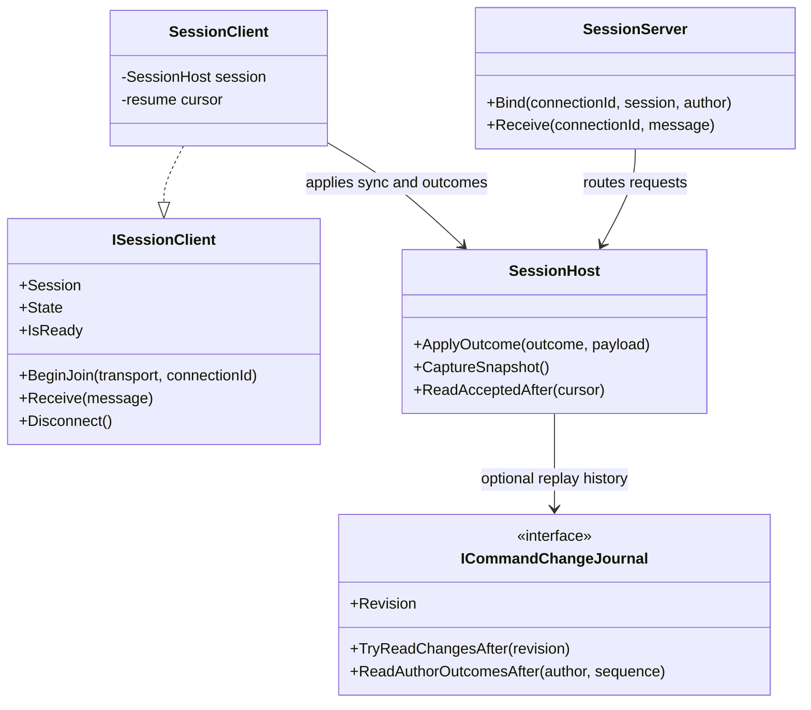

# DeltaNetcode API guide

DeltaNetcode owns command identity, validation, authoritative mutation, the
session journal and fixed-step rollback orchestration. The application owns
payload encoding, simulation state, authentication, transport and game logic.

## One session owner

`SessionHost` is the concrete session object and implements `ISession`. It owns
the command registry, journal, model, transport routes and command preparation
state. Consumers that need only session operations can keep an `ISession`
reference; they do not need separate references to the host's registry, journal
or model.

`CurrentStep` is the last step applied by `Tick` or restored from a snapshot.
At construction it is `SessionStart.Step - 1`. `Tick(step)` advances the model
and updates the session's current step. A session cannot tick backward.

Validators receive a `CommandValidationContext` when they run. Its
`CurrentStep` is the last step applied by the authoritative session, so time
checks use the same clock as scheduling.

`ISession` exposes command registration, send/cancel, transport connection
attachment, authoritative outcome application, ticking, snapshots, typed
command dispatch and replay reads. `VisitCommandType<TVisitor>` dispatches a
registered type ID through `ICommandVisitor`; the visitor may be a class or a
struct. The session keeps its registry private.

## Commands

Commands are non-null value or reference types registered by a stable non-zero
`ulong` ID. Applications can register types manually or use `[NetCommand]` and
the generated `GeneratedCommands` catalog. The generated catalog supplies
registrations; the application chooses which registrations to add to its
`CommandRegistry`.

The application implements `ICommandPayloadHandler` to encode and decode
payloads. `SessionHost.Send` serializes the payload during the call and retains
the resulting bytes. Changing a reference-type payload afterward does not
change that submitted command.

Validators can apply to all command types or one typed command. A mutator runs
before authority accepts a command and can allocate stable IDs or deterministic
seeds through `CommandPreparation`. Preparation changes commit only for an
accepted command. The executor runs when the model reaches the command's
scheduled simulation step.

## Simulation and rollback

The application implements `ISimulation` for deterministic `Tick`, `Save` and
`Load` operations. `RollbackSessionModel` stores bounded snapshots and command
entries, then replays commands when an accepted late command or cancellation
changes prior history. Applications can provide another `ISessionModel` when
they need a different history strategy.

`CaptureSnapshot` saves a replay anchor plus session preparation state and a
`CommandCursor`. The anchor can precede `CurrentStep` so commands in the
rollback window remain replayable. `Restore` checks the session and protocol
IDs, loads the model, restores preparation state and clears the old journal.

After sending a snapshot, call `ISession.ReadAcceptedAfter(snapshot.Cursor)` to
get accepted, non-cancelled records that must be replayed. Each
`JournalRecord` owns its request and final payload bytes. Records are returned
in deterministic simulation order by `MemoryCommandJournal`.

`ICommandChangeJournal` optionally exposes a monotonically increasing revision
and complete changes after that revision. `MemoryCommandJournal` implements
this contract. A journal that has cleared or compacted older history reports
that the range is unavailable; the server then sends a snapshot instead.

## Client/server flow

`SessionMode.Local` processes commands in the local host. A server host
validates and mutates proposals before recording authoritative outcomes. A
client sends proposals through `ITransport`; commands marked
`[NetCommand(Predicted = true)]` are applied locally and reconciled when the
server outcome arrives.

`SessionServer` associates transport connection IDs with a session and the
author assigned by the application's authentication layer. For incoming
proposals it uses this bound author instead of trusting the author field in the
message. Call `Bind` after authentication, then pass client frames to
`SessionServer.Receive`. A client creates `SessionClient`, calls
`BeginJoin(transport, connectionId)`, and feeds received frames to `Receive`.
The client's `SessionStart.AuthorId` must match the author used by the server's
`Bind` call. The sync completion frame carries the authoritative current step;
the client advances its model to that step before it becomes ready.
The client becomes ready after applying either a snapshot plus accepted tail,
or a revisioned journal replay. The same `SessionClient` retains its resume
cursor across `Disconnect` and can join over a replacement connection.

At synchronization completion, the client resends any unresolved proposal or
cancellation with the same command key and serialized bytes. This lets the
server return the original journal outcome for a request it already processed.
The application must keep synchronization frames ordered through its
`ITransport`; the package does not add reliability, authentication, encryption,
compression or sockets.

`CommandProtocol` frames proposals, cancellations, outcomes, snapshots and
join/resume control messages. It does not provide sockets, reliability,
encryption, compression or authentication.
