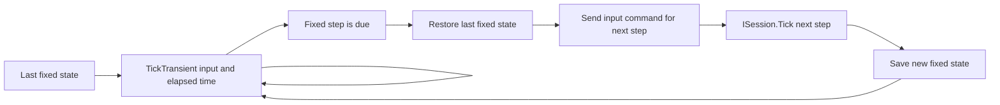

# Transient simulation updates

`ITransientSimulation<TInput>` is an optional application-side contract for
running the simulation more often than the session's fixed steps. It is useful
when local controls should respond between network or gameplay ticks.

```csharp
using System;
using System.Buffers;
using Delta.Netcode;

public readonly struct PlayerInput { }

public sealed class GameSimulation : ITransientSimulation<PlayerInput>
{
    public void TickTransient(in PlayerInput input, double deltaTimeSeconds)
    {
        // Update simulation state for local responsiveness.
    }

    public void Tick(long simulationStep)
    {
        // Advance one fixed session step.
    }

    public void Save(IBufferWriter<byte> output) { /* write complete state */ }
    public void Load(ReadOnlySpan<byte> state) { /* replace complete state */ }
}
```

## Call sequence

The application owns the frame loop, input sampling, fixed-step accumulator and
checkpoint storage. DeltaNetcode does not call `TickTransient` or schedule
transient updates.



At session creation, save the initial simulation state. Between fixed steps,
call `TickTransient` from the ordinary frame loop with the sampled local input
and elapsed time in seconds. These calls may update the live simulation state,
but they do not advance `ISession.CurrentStep`, execute session commands or add
records to the command journal.

When the next fixed step is due:

1. Restore the last fixed state with `ISimulation.Load`.
2. Submit the input for that step through `ISession.Send`.
3. Call `ISession.Tick` for the step. This runs the session's fixed-step path,
   including scheduled command execution and the simulation's `Tick`.
4. Save the resulting simulation state as the next fixed checkpoint.
5. Continue transient updates from that state.

The application decides how samples from transient updates contribute to the
command for the fixed step. For example, held input can be sampled again at the
boundary, while accumulated mouse movement or button presses may need an
application-owned buffer. The package does not record transient input or turn
it into a command automatically.

## Checkpoint ownership

Store checkpoints using the same complete simulation representation accepted
by `ISimulation.Load`. In the application code, the capture and restore calls
can follow this pattern:

```csharp
using System.Buffers;

var checkpoint = new ArrayBufferWriter<byte>();

// After initial setup and each fixed session tick:
checkpoint.Clear();
simulation.Save(checkpoint);

// When the next fixed step is due:
simulation.Load(checkpoint.WrittenSpan);
```

This fragment assumes `simulation` is the application's
`ITransientSimulation<TInput>`. The writer owns the checkpoint bytes until the
next capture, so it can be reused without copying the saved state.

This is an application checkpoint for transient updates. It is different from
`ISession.CaptureSnapshot()`, which captures a replay anchor and session
metadata for synchronization or persistence. Do not use a replay anchor as the
checkpoint for the immediately preceding fixed tick.

If an authoritative outcome or late command changes fixed-step history, the
session model must reconcile that history through its normal session tick
processing. Once the simulation contains the corrected fixed-step state, capture
a new application checkpoint before continuing transient updates from it. A
checkpoint saved before that correction is stale.

## Boundaries

- `TickTransient` is called only when the application opts into this interface.
- It is a simulation update; general frame work, rendering, input acquisition
  and time accumulation remain application responsibilities.
- Transient changes are not part of rollback history. Restoring a fixed
  checkpoint discards them, so irreversible effects such as audio, analytics
  or external writes should not be triggered from transient simulation unless
  the application can safely repeat or reconcile them.
- The application owns any transient input accumulation and the choice of
  which input becomes a fixed-step command.
- The fixed simulation remains responsible for deterministic `Tick`, `Save`
  and `Load` behavior used by rollback and snapshots.
